# System Patterns

*This document describes the system architecture, key technical decisions, design patterns, component relationships, and critical implementation paths for the `openai_responses` Elixir library.*

## System Architecture Overview

The library acts as a client wrapper around the OpenAI Responses API. It provides a simplified Elixir interface, handling HTTP requests, response parsing, and common tasks like streaming and input formatting. It appears to follow a modular structure built upon the `Req` HTTP client.

```mermaid
graph LR
    A[User Application] --> B(OpenAI.Responses Façade);
    B --> C{OpenAI.Responses.Client};
    B --> D[OpenAI.Responses.Helpers];
    B --> E[OpenAI.Responses.Stream];
    C --> F{Req Library};
    E --> F;
    D --> G[OpenAI.Responses.Helpers.ImageHelpers];
    style F fill:#f9f,stroke:#333,stroke-width:2px;
```

## Key Technical Decisions

- **Use `Req` Library:** Leveraging `Req` for HTTP requests and its built-in streaming capabilities (`:into`) provides a robust foundation.
- **Multiple Configuration Methods:** Allowing API key configuration via environment variables, direct parameters, or a client instance offers flexibility to users.
- **Dedicated Helper Modules:** Separating general helpers (`Helpers`) and specific helpers (`ImageHelpers`) improves organization.
- **Streaming Abstraction:** Providing dedicated functions (`stream`, `text_deltas`, `collect_stream`) simplifies the consumption of streaming API responses.

## Design Patterns

- **Facade:** The main `OpenAI.Responses` module likely acts as a facade, providing a simple entry point to the library's functionality and coordinating calls to other internal modules (`Client`, `Stream`, `Helpers`).
- **Client Object:** The `OpenAI.Responses.Client` allows for stateful configuration (like API key, base URL) and potentially request customization. This resembles aspects of a configurable client or strategy pattern.
- **Helper Module:** Consolidating utility functions into `Helpers` and `ImageHelpers` follows the Helper/Utility Module pattern.

## Component Relationships

- **`OpenAI.Responses` (Facade):** Delegates tasks to `Client` for request execution, `Stream` for streaming logic, and `Helpers` for data manipulation/formatting.
- **`OpenAI.Responses.Client`:** Configured with API credentials and other settings. Interacts directly with the `Req` library to make HTTP calls to the OpenAI API.
- **`OpenAI.Responses.Stream`:** Manages the streaming process, likely using `Req`'s streaming features and potentially parsing event chunks.
- **`OpenAI.Responses.Helpers`:** Provides stateless utility functions used by the facade or directly by the user application for tasks like input creation (delegating to `ImageHelpers` for images) and output parsing.
- **`OpenAI.Responses.Config`:** Likely used by `Client` or the facade to retrieve configuration settings (e.g., API key from env vars).
- **`OpenAI.Responses.Schema` / `Types`:** Define the data structures for API requests and responses.

## Critical Implementation Paths

- **Request Creation & Execution:** `OpenAI.Responses.create` -> `Client.request` -> `Req.request`.
- **Streaming:** `OpenAI.Responses.stream` -> `Stream.start_stream` -> `Req.request` (with `:into`) -> `Stream.process_chunk`. Helper functions like `text_deltas` and `collect_stream` build upon the raw stream.
- **Image Input Handling:** `Helpers.create_input_message` (with image paths) -> `ImageHelpers.encode_local_image` -> formatting into API structure.
